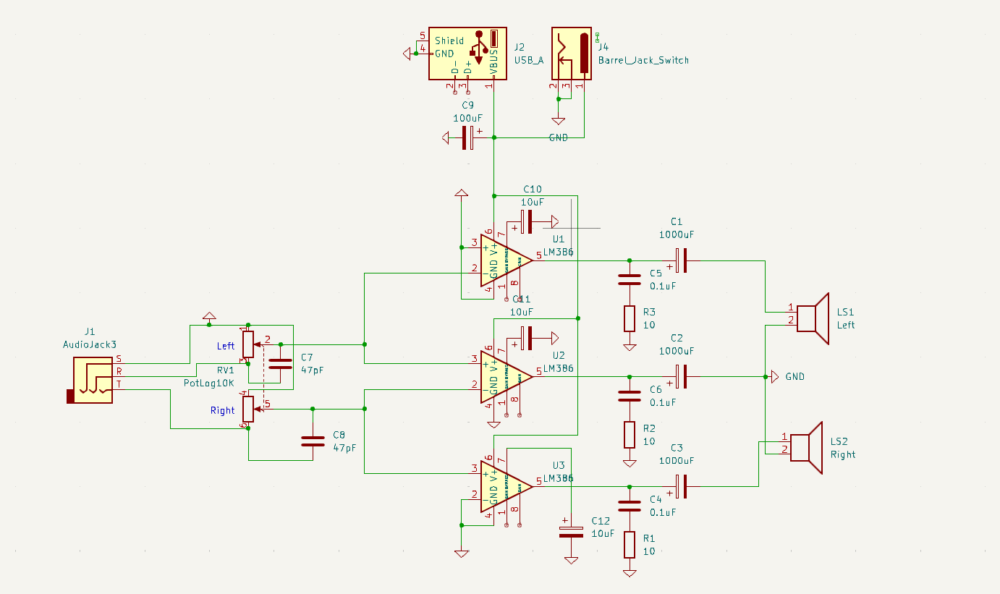

# Stereo audio amp

Designed a simple audio amplifier using ICs that I had laying around.
Works surprisingly well up to 12V, although you need a clean power supply, otherwise you need additional filters on the power input side.

# Schematic

